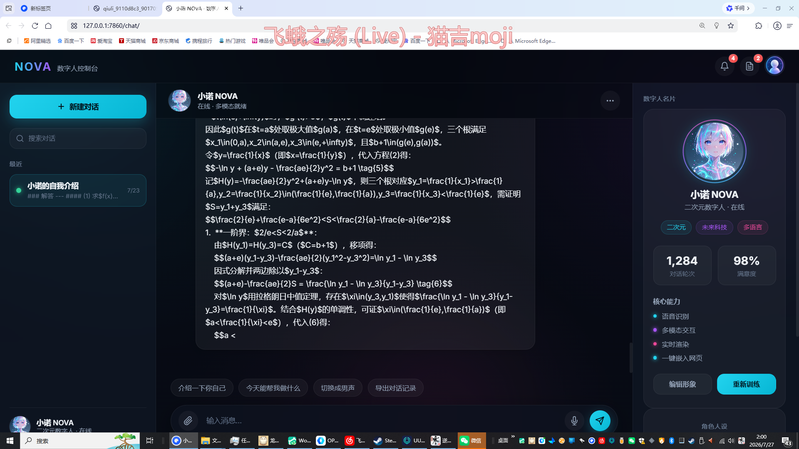

# NOVA — 次世代 AI 数字生命体

> 一个支持多模型路由、语音交互和人格进化的 AI 聊天平台。独立全栈开发，后端 ~2000 行 Python / 前端 ~2200 行 JS，30+ API 接口。



---

## ✨ 核心功能

| 模块 | 说明 |
|------|------|
| 🧠 **双模型智能路由** | 日常对话走本地 Ollama（qwen3:4b，零成本），复杂推理自动切换火山方舟 ARK（Doubao Seed 2.1 Pro），成本与效果平衡 |
| 💬 **实时流式对话** | SSE 推送打字机效果，支持断流恢复与异常兜底 |
| 🎤 **语音全链路** | ARK 语音识别（ASR）输入 + TTS 语音播报输出 |
| 👤 **人格系统** | 每条对话独立 AI 人设（System Prompt），人格可自定义、可学习进化 |
| 🧬 **记忆学习** | 对话轮次达标自动提取记忆，增量更新角色画像，实现「越聊越懂你」 |
| 📁 **AI 文件生成** | 模型可生成 .txt / .html / .py 等代码文件，正则自动识别类型并安全落盘 |
| 🔐 **用户体系** | 注册 / 登录（bcrypt 哈希）/ 头像上传 / 密码修改 / 账号注销 |
| 🔔 **通知公告** | 平台级公告面板，管理员可推送 |
| 🎨 **交互细节** | 对话置顶 / 字体缩放 / 密码显隐 / 路由调度日志 |

---

## 🏗️ 架构概览

```
┌──────────────────────────────────────────────┐
│                    前端                       │
│        chat/index.html + app.js + style.css  │
│              Web Speech API + SSE            │
└──────────────────┬───────────────────────────┘
                   │  HTTP / SSE
┌──────────────────▼───────────────────────────┐
│                Flask 后端                     │
│              backend.py (2036 行)             │
│                                               │
│  ┌──────────┐  ┌──────────┐  ┌────────────┐  │
│  │ 路由调度  │  │ 用户认证  │  │ 人格管理    │  │
│  └──────────┘  └──────────┘  └────────────┘  │
│  ┌──────────┐  ┌──────────┐  ┌────────────┐  │
│  │ 语音处理  │  │ 文件生成  │  │ 记忆学习    │  │
│  └──────────┘  └──────────┘  └────────────┘  │
└──────┬──────────────┬──────────────┬─────────┘
       │              │              │
┌──────▼──────┐ ┌─────▼─────┐ ┌─────▼──────────┐
│   Ollama    │ │ 火山 ARK  │ │    MySQL 8.0   │
│  qwen3:4b   │ │  Seed 2.1 │ │ 用户/对话/记忆  │
│  (本地免费)  │ │ (云端推理) │ │   (持久化)      │
└─────────────┘ └───────────┘ └────────────────┘
```

---

## 🛠️ 技术栈

| 层级 | 技术 |
|------|------|
| **后端框架** | Python 3 + Flask |
| **实时通信** | Server-Sent Events (SSE) |
| **数据库** | MySQL 8.0 + PyMySQL |
| **LLM 本地** | Ollama + qwen3:4b |
| **LLM 云端** | 火山方舟 ARK (Doubao Seed 2.1 Pro / DeepSeek-V3) |
| **语音识别** | ARK ASR + Web Speech API |
| **语音合成** | ARK TTS |
| **认证加密** | bcrypt 哈希 |
| **前端** | 原生 HTML5 + CSS3 + JavaScript (ES6+) |
| **部署** | Docker Compose / frp 内网穿透 |

---

## 🚀 快速开始

### 前提条件

- Python 3.10+
- MySQL 8.0
- [Ollama](https://ollama.com/) + qwen3:4b 模型

```bash
# 拉取本地模型（可选，也可纯用 ARK 云端）
ollama pull qwen3:4b
```

### 1. 初始化数据库

```bash
# 创建数据库和用户
mysql -u root -p -e "
CREATE DATABASE IF NOT EXISTS speek DEFAULT CHARSET utf8mb4;
CREATE USER IF NOT EXISTS 'speek'@'127.0.0.1' IDENTIFIED BY 'speek_pass';
GRANT ALL ON speek.* TO 'speek'@'127.0.0.1';
FLUSH PRIVILEGES;
"

# 建表
mysql -u speek -pspeek_pass -h 127.0.0.1 speek < speek/create_tables.sql
```

### 2. 配置环境变量

在项目根目录创建 `.env` 文件：

```env
ARK_API_KEY=你的火山方舟API密钥
DB_HOST=127.0.0.1
DB_PORT=3306
DB_USER=speek
DB_PASSWORD=speek_pass
DB_NAME=speek
LOCAL_LLM_MODEL=qwen3:4b
LOCAL_LLM_URL=http://127.0.0.1:11434/v1/chat/completions
```

### 3. 安装依赖 & 启动

```bash
pip install flask requests pymysql bcrypt

# 启动后端
python speek/backend.py

# 访问
# 首页：  http://localhost:7860/home/
# 聊天：  http://localhost:7860/chat/
# 认证：  http://localhost:7860/auth/
```

---

## 📡 API 接口一览

| 端点 | 方法 | 说明 |
|------|------|------|
| `/api/health` | GET | 健康检查 |
| `/api/chat` | POST | 核心对话（SSE 流式） |
| `/api/voice` | POST | 语音识别（ASR） |
| `/api/tts` | POST | 语音合成（TTS） |
| `/api/register` | POST | 用户注册 |
| `/api/login` | POST | 用户登录 |
| `/api/user/password` | POST | 修改密码 |
| `/api/user/avatar` | POST | 上传头像 |
| `/api/user/delete` | POST | 注销账号 |
| `/api/forgot/reset` | POST | 重置密码 |
| `/api/character` | GET/POST | 角色人设管理 |
| `/api/character/learn` | POST | 手动触发学习 |
| `/api/character/learn-file` | POST | 从文件批量学习 |
| `/api/bot/avatar` | POST | AI 角色头像 |
| `/api/memory` | GET/POST | 对话记忆管理 |
| `/api/title` | POST | 自动生成对话标题 |
| `/api/announcements` | GET | 公告列表 |
| `/api/llm-test` | GET | Ollama 连接测试 |
| `/api/ark-test` | GET | ARK 连接测试 |
| `/api/routing-log` | GET | 路由调度日志 |
| `/api/upload` | POST | 文件上传 |

---

## 📁 项目结构

```
.
├── .env                      # 环境变量（敏感信息，已 gitignore）
├── README.md
├── docs/
│   └── screenshots/          # 项目截图
├── homepage/                 # 产品首页（独立页面）
├── auth/                     # 登录/注册页面
└── speek/
    ├── backend.py            # Flask 后端主程序（2036 行）
    ├── index.html            # 聊天页面
    ├── app.js                # 前端交互逻辑（2209 行）
    ├── style.css             # 样式表（2033 行）
    ├── create_tables.sql     # 数据库建表脚本
    ├── requirements.txt
    ├── character_profile.json # 默认角色配置
    ├── announcements.json    # 公告数据
    ├── launch.py             # 一键启动脚本
    ├── migrate.py            # 数据迁移工具
    ├── data/                 # 用户数据（已 gitignore）
    │   ├── users/
    │   ├── bot_avatars/
    │   └── ...
    ├── genfiles/             # AI 生成文件输出
    ├── temp_audio/           # TTS 临时音频
    ├── uploads/              # 用户上传文件
    ├── avatars/              # 用户头像
    └── voices/               # 语音相关
```

---

## 🔄 模型路由策略

| 场景 | 使用模型 | 位置 |
|------|----------|------|
| 普通对话（无思考） | qwen3:4b | Ollama 本地 |
| 开启深度思考 | qwen3:4b (thinking) | Ollama 本地 |
| 文件生成 | Doubao Seed 2.1 Pro | ARK 云端 |
| 自动回退 | 本地不可用 → ARK | — |

路由调度全程可观测，`/api/routing-log` 返回每次请求的调度决策。

---

## 🧬 人格学习机制

1. 每条对话绑定独立的角色人设（System Prompt）
2. 对话轮次累积达到阈值（默认 8 轮），后台自动提取关键信息
3. 新知识以增量方式写入角色画像的 `learned` 字段
4. 后续对话自动携带学习到的记忆，实现「越聊越懂你」
5. 支持手动触发学习：`POST /api/character/learn`

---

## 📝 License

MIT
